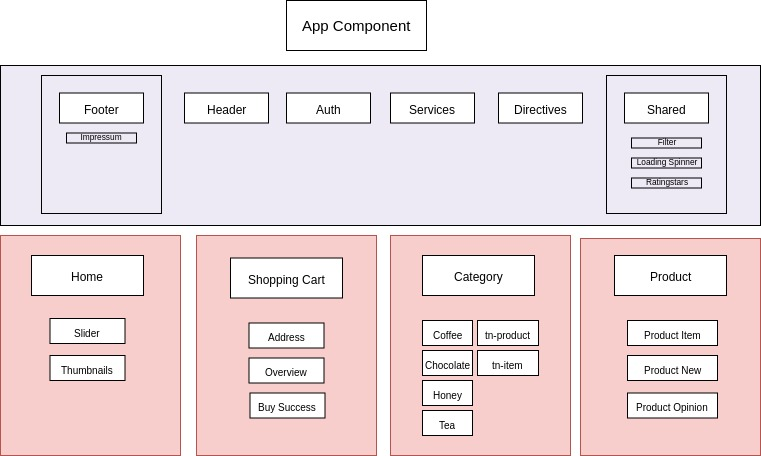
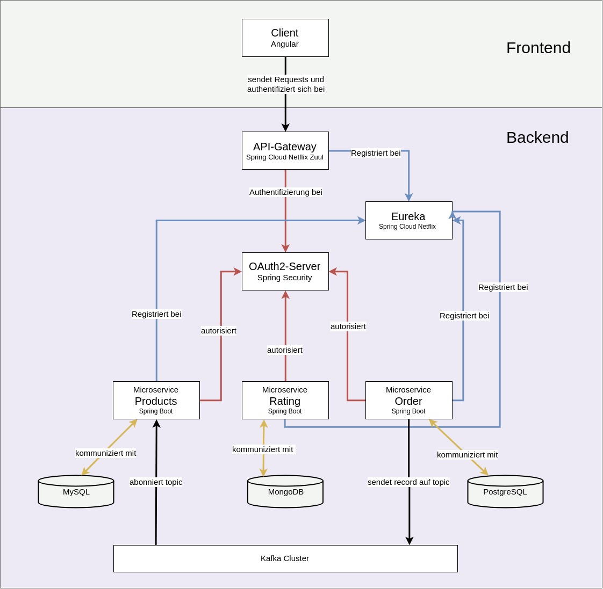

# SPRING Fair Shop

*Ein Beispielprojekt für einen E-Commerce-Shop*

Live-Demo: http://fair-kaufen.info

## Aufbau und Struktur

### Frontend 

Das Frontend basiert auf Angular und dem Bootstrap Framework (3.4.1). 

#### Application-wide Elements und Services

##### Auth - Component:  

- Sendet Post-Request mit Password Credentials an das API-Gateway (Form Login)
- Verarbeitet Token von OAuth2-Server und autorisiert damit Requests 

##### Services: 

- Ermöglicht Kommunikation zwischen Components und verarbeitet Requests an das Backend

##### Directives: 

- Highlight Directive für "hovereffect" 

##### Shared:

- Filter
  - Enthält Filter-Pipelines für Price-Slider / Kategorien
- Loading Spinner
- Models
  - Rating, Product, Credentials und Address Model
- Rating Stars
  - Errechnet aus allen Ratings zu einem bestimmten Produkt den Durchschnittswert und gibt ihn als Stars-Level wieder 

##### Header-Component:

- Enthält Navigation
- Prüft Authentifizierung für Navigationselemente (z.B. Product New (Produktverwaltung))

- Footer-Component: 
  - Enthält Navigation und verweist auf Impressum-Component

#### Core Components

##### Home

- Slider für Startseite 
- Thumbnails mit Kategorien

##### Shopping Cart

- Overview
  - Prüft Authentifizierung
  - Stellt gewählte Produkte dar
  - Errechnet Gesamt-, Produkt- und Versandkosten
- Buy Success
  - Wird angezeigt nach erfolgreicher Produktbestellung
- Adress
  - Verarbeitet Addressdaten von Backend-Service für den View

##### Category

- Ermöglicht Darstellung der Produkte aus bestimmten Kategorien
- tn-product and tn-item: Thumbnail-Darstellung von Produkten mit Link zu Detaildarstellung (Product Item)
- Integriert Price-Slider und filtert Produkte nach Preis

##### Product

- Product Item
  - Detaildarstellung von gewähltem Produkt mit Kaufoption mit Mengenangabe
- Product New
  - Ermöglicht Hinzufügen und Löschen von Produkten (nur als Admin)
- Product Opinions
  - Ermöglicht, einem Produkt Ratings hinzuzufügen

    ​

### Backend

##### API-Gateway

- Bündelt alle Request des Clients 

  => Schnittstelle zwischen Backend und Frontend

- Regelt Authentifizierung am OAuth2-Server (s.u.)

##### Eureka

- Registiert alle Micoservices und ermöglicht Kommunikation zwischen Microservices (vor allem zwischen API-Gateway und anderen Microservices)

##### OAuth2-Server

- Authentifiziert API-Gateway 
- Stellt Access Token für Client (nach Prüfung bei Resource Server) aus (s.u.)

##### Products

- Zentrale Produktverwaltung basierend auf Spring Boot mit REST API
- Kafka Consumer (s.u.)
- Resource Server
- Kommuniziert mit MySQL Datenbank

##### Rating

- Zentrale Verwaltung von Ratings zu Produkten
- Kommuniziert mit MongoDB Datenbank

##### Order

- Zentrale Adressverwaltung von Benutzern
- Kafka Producer - Verarbeitet Request von Client ("Shopping Cart") als Kafka Message (s.u.) 

##### 1.2.7 Kafka

- Streamprozessor für die Kommunikation zwischen Microservices 

  ​

##### 1.2.8 Authentifizierung

Die Authentifizierung mit OAuth2 orientiert sich an dem (quelloffenen) best practice Beispiel von viadee. 

Siehe hier: https://github.com/viadee/DeicheFuerDieInseln

Die Architektur wurde erweitert und konfiguriert bzw. der Architektur des SPRING Fair Shop angepasst.

##### Ein kurzer Überblick

Die Authentifizierung am OAuth-Server geschieht mittels **Resource Owner Password Credential Grant**.  

1. Das API-Gateway authentifiziert den Client mit den Resource Owner Password Credentials beim OAuth2-Server.
2. Der OAuth2-Server prüft beim Resource Server, ob eine Berechtigung für den Ressourcen-Zugriff besteht.
3. Der Resource-Server des jeweiligen Microservices autorisiert den Zugriff (oder nicht) und kommuniziert die Freigabe an den OAuth2-Server.
4. Der OAuth2-Server stellt ein Access Token für den Client aus.

##### 1.2.9 Kafka

Folgend ein kurzer Überlick zur Implementierung:

1. Im Shopping Cart-Component wird ein Request gesendet (Der Request Body enthält ein Produktobjekt in JSON Format mit einer veränderten Bestandsmenge des Produkts).
2. Der Order-Microservice konvertiert den Request und gibt die geänderten Produktdaten als Kafka Message an den Kafka Cluster (topic "ordered_item") weiter.
3. Der Products-Microservice abonniert das topic "ordered_item" und kommunziert die Änderung an die MySQL-Datenbank.

### Kubernetes

Der SPRING Fair Shop nutzt zur Container-Orchestrierung Kubernetes und Docker.

Unter "kubernetes_config" befinden sich alle YAML-Konfigurationdateien für die lokale Entwicklung und für einen Amazon ECS-Cluster.

Die Images für die jeweiligen Pods sind zentral verwaltet bei Docker Hub:

<https://hub.docker.com/u/tobiasbecode>

##### 2.1 Workload-Services

- Konfiguration für die Deployments von den Microservices Products, Rating, Order, OAuth2, API-Gateway und Eureka. 
- Services bündelt Konfigurationen für die entsprechenden Pods

##### 2.2 Databases

- Konfiguration für die Deployments von MySQL, PostgreSQL und MongoDB
- Konfiguration für Persistent Volume Claims und Storage Classes

##### 2.3 Kafka

- Konfiguration für Kafka / Zookeeper Deployment

##### Übersicht zu den Ports

| Port     | Anwendung   | Pods in Verbindung                           |
| :------- | ----------- | -------------------------------------------- |
| `443`    | Kubernetes  | Alle                                         |
| `2181`   | Kafka       | Products, Order                              |
| `2888`   | Kafka       | Products, Order                              |
| `3306`   | MySQL       | Products                                     |
| `3030`   | Kafka       | Products, Order                              |
| ``3888`` | Kafka       | Products, Order                              |
| `5432`   | PostGreSQL  | Order                                        |
| `8000`   | Order       | Order                                        |
| `8283`   | OAuth2      | Products, Rating, Order, API-Gateway         |
| `8751`   | Rating      | Rating                                       |
| `8755`   | Products    | Products                                     |
| `8761`   | Eureka      | Products, Rating, Order, API-Gateway, OAuth2 |
| `8765`   | API-Gateway | Products, Rating, Order OAuth2               |
| `9092`   | Kafka       | Products, Order                              |
| `27017`  | MongoDB     | Rating                                       |
